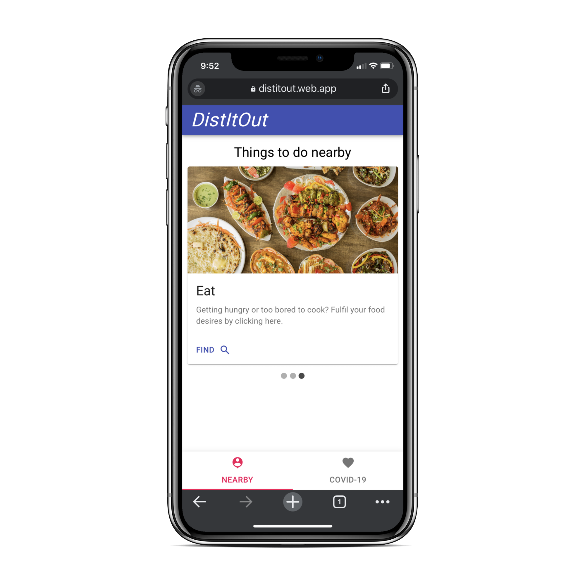
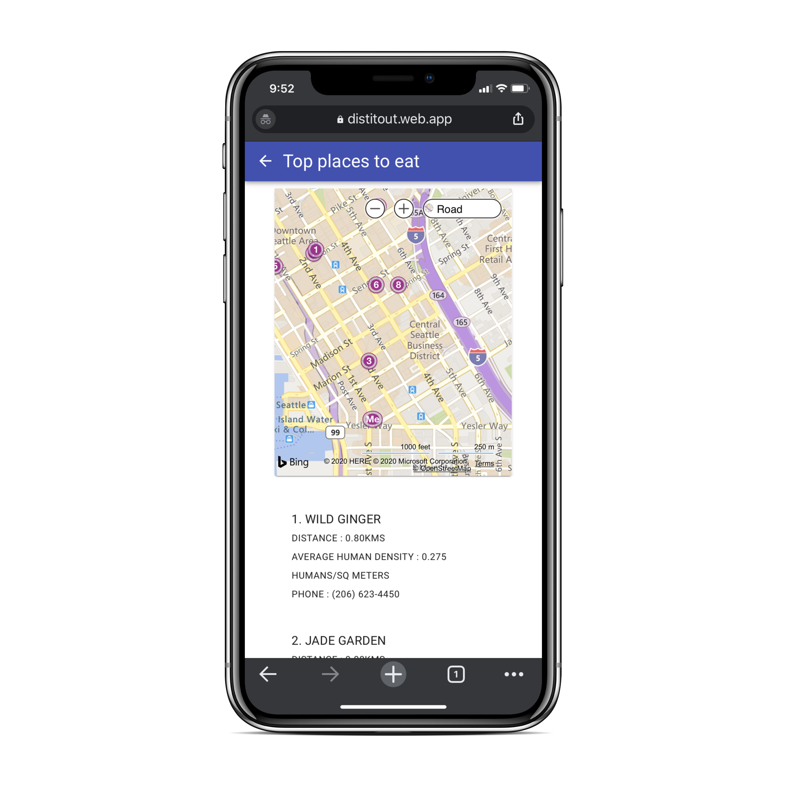

# Since social distancing is the new norm now,

we are building an app that functions as a means to make this more easy and accessible to everyone.

# Here are some core functionalities:
- Recommending the best possible nearest locations such as Shopping centers
- Recreation places and eateries in order to optimize density of people
- warnings if there are too many covid cases in the surrounding areas, etc. 

> The idea is to build a unified platform which would be an invaluable accessory during these critical times.

# Here are some of the screenshots of the app built

